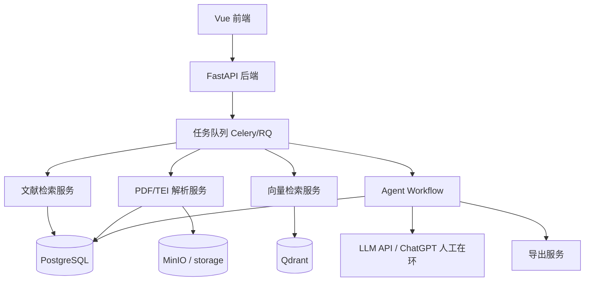
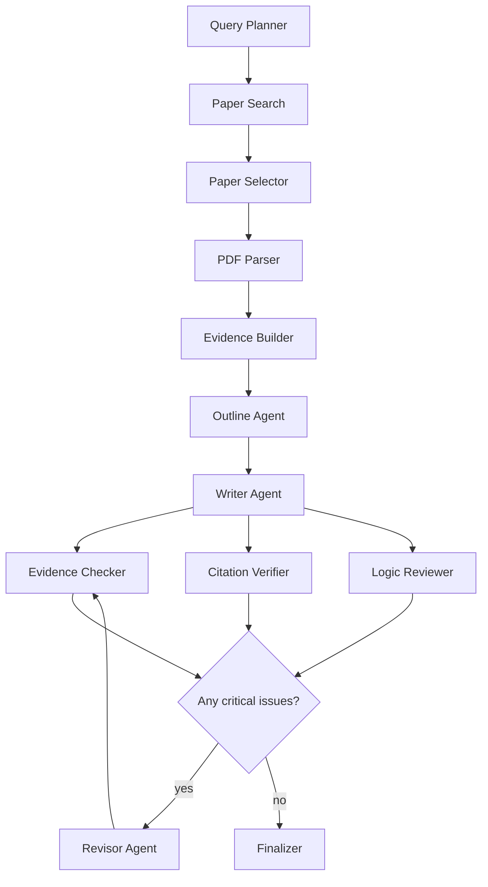

# PaperForge 文铸：AI 论文读取与出版准备级写作系统开发方案 v2

> PaperForge，中文副名“文铸”，是一个基于论文证据、引用核验与多轮审稿机制的 AI 出版准备级研究写作系统。本方案把原报告中的“可行性分析”压缩为 Codex 可执行的工程任务书。目标不是做“全自动发表机”，而是做一个可审计、可追溯、可人工终审的“出版准备级研究写作系统”。

---

## 0. 结论先行

### 项目命名

```text
英文名：PaperForge
中文副名：文铸
完整名：PaperForge 文铸
英文副标题：Evidence-grounded AI Research Writing Engine
中文副标题：基于论文证据的 AI 出版准备级写作系统
```

命名含义：

```text
Paper 对应论文、文章和稿件。
Forge 对应锻造、打磨、审稿、修订和成稿。
文铸强调“以证据为炉、以引用为模、以审稿为锤”，把原始文献锻造成可审计、可修改、可出版准备的研究文章。
```


### 推荐路线

第一阶段不要做大模型本地部署，不做微调，不做复杂训练。

先实现：

```text
元数据检索 → OA 全文定位 → PDF/TEI 解析 → 证据卡 → 大纲 → 初稿 → 引用核验 → 修订 → 导出投稿包
```

### 当前最佳技术栈

```text
后端：FastAPI + SQLAlchemy + Alembic
前端：Vue 3 + Vite + TypeScript
数据库：PostgreSQL
向量库：Qdrant
任务队列：Redis + Celery/RQ
文件存储：MinIO 或本地 storage
PDF 解析：GROBID + PyMuPDF
文献来源：OpenAlex + Crossref + Unpaywall + arXiv + Europe PMC
Agent 编排：LangGraph
导出：Markdown + DOCX + PDF + BibTeX + evidence_map.json
```

### 第一版 MVP 目标

```text
输入：主题、文章类型、目标字数、语言、引用格式
输出：
1. 文献候选列表
2. 证据卡 Evidence Cards
3. 文章大纲
4. 带引用的 Markdown 初稿
5. 引用与证据审查报告
6. 修订版文章
7. 导出投稿包
```

---

## 1. 项目边界

### 1.1 做什么

本系统做：

```text
自动检索开放论文和元数据
自动解析合法获得的 PDF
自动构建证据卡
自动生成大纲和初稿
自动检查引用、证据、逻辑和风格
自动修订
自动导出文章和审查报告
```

### 1.2 不做什么

第一版不做：

```text
不绕过付费墙
不伪造 DOI、作者、期刊和页码
不自动投稿
不声称无需人工审校
不本地部署大模型
不做复杂 LoRA / SFT / RFT
不做多人权限系统
不做完整期刊投稿平台
```

---

## 2. 系统架构



---

## 2.5 UI/UX 设计规范

前端所有页面和组件的设计与实现必须遵循 `ui-ux-pro-max` Skill 的设计标准。

### 使用方式

在编写或重构前端页面时，先查阅该 Skill 的 `--design-system` 流程生成设计系统，再实现代码。关键检查清单：

- **Accessibility**：对比度 4.5:1、可见 focus ring、aria-label、键盘导航
- **Touch & Interaction**：按钮最小 44×44px、点击反馈 80-150ms、不依赖 hover
- **Performance**：骨架屏替代长加载、图片懒加载、避免布局抖动
- **Style Selection**：风格一致、SVG 图标、不使用 emoji 作为结构图标
- **Layout & Responsive**：Mobile-first、系统断点、无横向滚动
- **Typography & Color**：语义化颜色 token、字重层级、可读行宽
- **Animation**：150-300ms 微交互、transform/opacity 动画、支持 reduced-motion
- **Forms & Feedback**：可见标签、inline validation、错误就近显示、渐进披露
- **Navigation Patterns**：可预测的返回行为、深层链接、导航状态高亮
- **Charts & Data**：图例可见、tooltip、不依赖颜色传递信息

### 关键页面设计优先级

| 页面 | 设计焦点 | 推荐风格 |
|------|---------|---------|
| ProjectList | Dashboard / 数据概览 | 清晰卡片网格、空状态引导 |
| ProjectDetail | 控制台 / 流程可视化 | 阶段进度条、实时日志、统计数据 |
| PaperLibrary | 数据表格 / 筛选 | 可排序表格、批量操作、标签筛选 |
| EvidenceBoard | 信息看板 / 卡片墙 | 可筛选卡片、颜色编码强度 |
| DraftEditor | 编辑器 / 版本对比 | 双栏布局、版本切换、Markdown 渲染 |
| ReviewPanel | 审查报告 / 问题列表 | 严重度分级、可折叠详情、导出操作 |
| LLMSettings | 配置管理 / 卡片列表 | Provider 卡片网格、预设选择、实时测速 |

---

## 3. 核心数据流

```text
1. 用户创建项目
2. 系统根据研究问题生成检索 queries
3. 从 OpenAlex / Crossref / arXiv / Europe PMC 搜索论文
4. 用 DOI、标题相似度、arXiv ID 去重
5. 用 Unpaywall 判断是否有合法 OA PDF
6. 下载 OA PDF 或接收用户上传 PDF
7. GROBID 解析 PDF 为 TEI
8. 解析章节、页码、引用、参考文献
9. 切块并写入 Qdrant
10. 从 chunks 生成 Evidence Cards
11. Evidence Cards 生成大纲
12. Writer Agent 生成初稿
13. Evidence Checker 检查断言是否有证据
14. Citation Verifier 检查引用是否真实且支持论断
15. Logic Reviewer 检查推理、结构和过度外推
16. Revisor Agent 修订
17. 导出 Markdown / DOCX / PDF / BibTeX / 审稿报告
```

---

## 4. 后端目录结构

```text
paperforge/
  backend/
    app/
      main.py
      config.py
      database.py

      api/
        routes/
          projects.py
          papers.py
          evidence.py
          drafts.py
          reviews.py
          exports.py
          tasks.py

      models/
        project.py
        paper.py
        paper_chunk.py
        evidence_card.py
        draft.py
        review_issue.py
        citation.py

      schemas/
        project.py
        paper.py
        evidence.py
        draft.py
        review.py
        workflow.py

      services/
        search/
          openalex.py
          crossref.py
          arxiv.py
          europe_pmc.py
          unpaywall.py
          dedupe.py
          ranker.py

        ingestion/
          downloader.py
          grobid_client.py
          pymupdf_parser.py
          tei_parser.py
          chunker.py
          metadata_normalizer.py

        retrieval/
          embeddings.py
          qdrant_store.py
          bm25_store.py
          hybrid_search.py
          reranker.py

        agents/
          graph.py
          prompts.py
          nodes/
            query_planner.py
            paper_selector.py
            evidence_builder.py
            outline_writer.py
            article_writer.py
            evidence_checker.py
            citation_verifier.py
            logic_reviewer.py
            style_editor.py
            revisor.py
            finalizer.py

        quality/
          claim_extractor.py
          citation_checker.py
          evidence_coverage.py
          style_score.py
          quality_score.py

        export/
          markdown_exporter.py
          docx_exporter.py
          pdf_exporter.py
          bibtex_exporter.py
          evidence_map_exporter.py

      workers/
        celery_app.py
        tasks.py

      utils/
        ids.py
        text.py
        citations.py
        logging.py

    alembic/
    tests/
    pyproject.toml
    Dockerfile

  frontend/
    src/
      api/
      views/
        ProjectList.vue
        ProjectDetail.vue
        PaperLibrary.vue
        EvidenceBoard.vue
        DraftEditor.vue
        ReviewPanel.vue
      components/
        TaskProgress.vue
        EvidenceCard.vue
        PaperTable.vue
        MarkdownEditor.vue
        ReviewIssueList.vue

  docker-compose.yml
  .env.example
  README.md
```

---

## 5. 数据库设计

### 5.1 projects

```sql
CREATE TABLE projects (
    id UUID PRIMARY KEY,
    title TEXT NOT NULL,
    research_question TEXT NOT NULL,
    article_type TEXT NOT NULL,
    target_audience TEXT,
    language TEXT DEFAULT 'zh',
    target_words INTEGER DEFAULT 5000,
    citation_style TEXT DEFAULT 'GB/T 7714',
    status TEXT DEFAULT 'created',
    settings JSONB DEFAULT '{}',
    created_at TIMESTAMP DEFAULT now(),
    updated_at TIMESTAMP DEFAULT now()
);
```

### 5.2 papers

```sql
CREATE TABLE papers (
    id UUID PRIMARY KEY,
    project_id UUID REFERENCES projects(id) ON DELETE CASCADE,
    title TEXT NOT NULL,
    authors JSONB DEFAULT '[]',
    year INTEGER,
    doi TEXT,
    arxiv_id TEXT,
    venue TEXT,
    abstract TEXT,
    source TEXT,
    source_url TEXT,
    pdf_url TEXT,
    oa_status TEXT,
    license TEXT,
    local_pdf_path TEXT,
    local_tei_path TEXT,
    relevance_score FLOAT DEFAULT 0,
    selected BOOLEAN DEFAULT false,
    parse_status TEXT DEFAULT 'pending',
    metadata JSONB DEFAULT '{}',
    created_at TIMESTAMP DEFAULT now(),
    updated_at TIMESTAMP DEFAULT now()
);
```

### 5.3 paper_chunks

```sql
CREATE TABLE paper_chunks (
    id UUID PRIMARY KEY,
    paper_id UUID REFERENCES papers(id) ON DELETE CASCADE,
    section TEXT,
    subsection TEXT,
    page_start INTEGER,
    page_end INTEGER,
    text TEXT NOT NULL,
    token_count INTEGER,
    vector_id TEXT,
    metadata JSONB DEFAULT '{}',
    created_at TIMESTAMP DEFAULT now()
);
```

### 5.4 evidence_cards

```sql
CREATE TABLE evidence_cards (
    id UUID PRIMARY KEY,
    project_id UUID REFERENCES projects(id) ON DELETE CASCADE,
    paper_id UUID REFERENCES papers(id) ON DELETE CASCADE,
    chunk_ids JSONB DEFAULT '[]',
    claim TEXT NOT NULL,
    supporting_text TEXT NOT NULL,
    evidence_type TEXT,
    strength TEXT,
    limitations TEXT,
    page_start INTEGER,
    page_end INTEGER,
    citation_key TEXT,
    used_in_draft BOOLEAN DEFAULT false,
    created_at TIMESTAMP DEFAULT now(),
    updated_at TIMESTAMP DEFAULT now()
);
```

### 5.5 drafts

```sql
CREATE TABLE drafts (
    id UUID PRIMARY KEY,
    project_id UUID REFERENCES projects(id) ON DELETE CASCADE,
    version INTEGER NOT NULL,
    title TEXT,
    content_md TEXT NOT NULL,
    status TEXT DEFAULT 'draft',
    quality_score JSONB DEFAULT '{}',
    created_at TIMESTAMP DEFAULT now()
);
```

### 5.6 review_issues

```sql
CREATE TABLE review_issues (
    id UUID PRIMARY KEY,
    project_id UUID REFERENCES projects(id) ON DELETE CASCADE,
    draft_id UUID REFERENCES drafts(id) ON DELETE CASCADE,
    severity TEXT NOT NULL,
    issue_type TEXT NOT NULL,
    location TEXT,
    claim TEXT,
    description TEXT NOT NULL,
    suggestion TEXT,
    evidence_ids JSONB DEFAULT '[]',
    resolved BOOLEAN DEFAULT false,
    created_at TIMESTAMP DEFAULT now()
);
```

---

## 6. API 设计

### 6.1 Project API

```text
POST   /api/projects
GET    /api/projects
GET    /api/projects/{project_id}
PATCH  /api/projects/{project_id}
DELETE /api/projects/{project_id}
```

创建项目请求：

```json
{
  "title": "AI 对亚太发展中国家的经济分化影响",
  "research_question": "AI 是否会加剧亚太地区国家之间的发展分化？",
  "article_type": "policy_report",
  "target_audience": "区域国别研究者和政策分析人员",
  "target_words": 8000,
  "language": "zh",
  "citation_style": "GB/T 7714"
}
```

### 6.2 Paper API

```text
POST /api/projects/{project_id}/search-papers
GET  /api/projects/{project_id}/papers
POST /api/projects/{project_id}/papers/upload
POST /api/papers/{paper_id}/select
POST /api/papers/{paper_id}/download
POST /api/papers/{paper_id}/parse
GET  /api/papers/{paper_id}/chunks
```

### 6.3 Evidence API

```text
POST /api/projects/{project_id}/build-evidence
GET  /api/projects/{project_id}/evidence
GET  /api/evidence/{evidence_id}
PATCH /api/evidence/{evidence_id}
DELETE /api/evidence/{evidence_id}
```

### 6.4 Writing API

```text
POST /api/projects/{project_id}/generate-outline
POST /api/projects/{project_id}/generate-draft
POST /api/projects/{project_id}/review-draft
POST /api/projects/{project_id}/revise-draft
GET  /api/projects/{project_id}/drafts
GET  /api/drafts/{draft_id}
```

### 6.5 Export API

```text
POST /api/projects/{project_id}/export/markdown
POST /api/projects/{project_id}/export/docx
POST /api/projects/{project_id}/export/pdf
POST /api/projects/{project_id}/export/bibtex
POST /api/projects/{project_id}/export/evidence-map
POST /api/projects/{project_id}/export/review-report
```

### 6.6 Task API

```text
GET /api/tasks/{task_id}
```

任务返回：

```json
{
  "task_id": "uuid",
  "status": "running",
  "progress": 65,
  "current_step": "Citation Verifier is checking references",
  "logs": [
    "Found 42 candidate papers",
    "Selected 18 papers",
    "Parsed 12 PDFs",
    "Built 96 evidence cards"
  ]
}
```

---

## 7. Agent Workflow

### 7.1 Agent 列表

```text
Query Planner Agent
Paper Selector Agent
Evidence Builder Agent
Outline Agent
Writer Agent
Evidence Checker Agent
Citation Verifier Agent
Logic Reviewer Agent
Style Editor Agent
Revisor Agent
Finalizer Agent
```

### 7.2 LangGraph 流程



### 7.3 停机条件

```text
最多修订 3 轮
critical issues = 0
unsupported claims = 0
citation validity >= 0.90
evidence coverage >= 0.90
连续两轮 overall_score 提升 < 0.02 时停止
```

---

## 8. Evidence Card 标准

Evidence Card 是系统的核心。Writer 不直接从全文自由发挥，只能基于 Evidence Cards 写作。

```json
{
  "evidence_id": "ev_001",
  "paper_id": "paper_001",
  "chunk_ids": ["chunk_001", "chunk_002"],
  "claim": "AI 可能通过技能偏向型技术变迁加剧劳动者收入分化。",
  "supporting_text": "论文原文或压缩后的证据摘要。",
  "evidence_type": "empirical_result",
  "strength": "medium",
  "limitations": "样本主要来自高收入国家，外推到亚太发展中国家需谨慎。",
  "page_start": 8,
  "page_end": 9,
  "citation_key": "smith2024_ai_labor"
}
```

### 证据类型

```text
definition
theory
empirical_result
case_study
dataset
method
counter_argument
limitation
policy_recommendation
```

### 证据强度

```text
strong：原文直接支持该论断，且研究方法或数据质量较高
medium：原文部分支持，但需要限定条件
weak：只提供背景或间接支持，不可支撑强结论
```

---

## 9. 质量门禁

### 9.1 Evidence Gate

规则：

```text
每个核心判断必须绑定 evidence_id
没有 evidence_id 的判断不得进入终稿
weak evidence 只能支持背景性描述，不能支持强结论
出现 counter_argument 时，文章必须体现争议或限制
```

### 9.2 Citation Gate

检查：

```text
DOI 是否存在
标题是否匹配
作者年份是否匹配
引用是否真的支持当前句子
是否把相关性写成因果性
是否把局部样本外推成普遍结论
```

### 9.3 Logic Gate

检查：

```text
概念是否定义清楚
论点是否递进
段落之间是否跳跃
是否存在循环论证
是否忽视反方证据
是否过度使用绝对化表达
```

### 9.4 Style Gate

按文章类型区分：

```text
policy_report：结论前置、政策建议明确、语气稳健
literature_review：文献脉络清楚、争议点明确、引用充分
wechat_article：开头有问题意识、段落短、案例多、少堆砌术语
academic_draft：定义清楚、方法可复核、限制条件完整
```

### 9.5 Publish-preparation Gate

只有满足以下条件，才标记为 `publication_prepared`：

```text
critical_issues = 0
unsupported_claims = 0
unresolved_citations = 0
evidence_coverage >= 0.90
citation_validity >= 0.90
logic_score >= 0.80
style_score >= 0.80
human_review_required = true
```

注意：`publication_prepared = true` 不等于可以无人投稿，只表示系统层面达到内部质量阈值。

---

## 10. Prompt 模板

### 10.1 Writer Agent

```text
你是一个严肃的研究型文章写作者。

你只能基于提供的 Evidence Cards 写作。
不得编造论文、作者、年份、数据、页码、DOI 或事实。
每一个核心判断都必须绑定 evidence_id。
遇到证据不足时，必须使用谨慎表达。
禁止使用“必然”“完全证明”“彻底改变”等无证据支持的绝对化表达。

输出 Markdown。
每个段落末尾用 HTML 注释记录 evidence_ids，例如：
<!-- evidence: ev_001, ev_003 -->
```

### 10.2 Evidence Checker

```text
你是事实与证据审查员。

任务：检查文章中的每一个核心论断是否被 Evidence Cards 支持。

请将每个论断标记为：
SUPPORTED
PARTIALLY_SUPPORTED
UNSUPPORTED
CONTRADICTED

对于 PARTIALLY_SUPPORTED、UNSUPPORTED、CONTRADICTED，必须给出修改建议。
不要重写全文，只输出审查报告 JSON。
```

### 10.3 Citation Verifier

```text
你是引用校验员。

检查每条引用是否满足：
1. DOI、标题、作者、年份一致
2. 引用内容确实支持当前论断
3. 没有把综述性观点写成实证结论
4. 没有把相关性写成因果性
5. 没有把局部样本外推成普遍判断

输出 JSON。
```

### 10.4 Revisor Agent

```text
你是高级研究编辑。

请根据 Review Issues 修改文章。
必须保留 evidence_id。
不得新增没有证据支持的核心判断。
对证据不足的句子，执行以下操作之一：
1. 删除
2. 降调
3. 改为问题式表达
4. 加入限制条件

输出修订后的 Markdown。
```

---

## 11. 前端页面

### 11.1 ProjectList

功能：

```text
新建项目
查看项目状态
查看任务进度
进入项目详情
导出最终稿
```

### 11.2 ProjectDetail

展示：

```text
项目标题
研究问题
文章类型
目标读者
目标字数
当前工作流状态
任务日志
```

### 11.3 PaperLibrary

功能：

```text
搜索论文
上传 PDF
查看 DOI / 年份 / 作者 / 期刊 / OA 状态
选择或取消选择论文
下载 OA PDF
解析 PDF
查看 chunks
```

### 11.4 EvidenceBoard

功能：

```text
查看 Evidence Cards
按证据类型筛选
按证据强度筛选
按论文筛选
查看原文页码
编辑 claim / limitations
标记证据是否可用于写作
```

### 11.5 DraftEditor

功能：

```text
Markdown 编辑器
右侧显示当前段落对应 evidence_ids
显示引用列表
显示质量评分
手动修改内容
重新审查
自动修订
```

### 11.6 ReviewPanel

功能：

```text
查看 critical / high / medium / low 问题
按 issue_type 筛选
接受修订建议
忽略低风险建议
重新运行审查
```

---

## 12. Docker Compose

第一版服务：

```yaml
services:
  backend:
    build: ./backend
    ports:
      - "8000:8000"
    env_file:
      - .env
    depends_on:
      - postgres
      - redis
      - qdrant
      - minio

  frontend:
    build: ./frontend
    ports:
      - "5173:5173"

  postgres:
    image: postgres:16
    environment:
      POSTGRES_DB: paperforge
      POSTGRES_USER: paperforge
      POSTGRES_PASSWORD: paperforge
    ports:
      - "5432:5432"

  redis:
    image: redis:7
    ports:
      - "6379:6379"

  qdrant:
    image: qdrant/qdrant:latest
    ports:
      - "6333:6333"

  minio:
    image: minio/minio:latest
    command: server /data --console-address ":9001"
    environment:
      MINIO_ROOT_USER: minio
      MINIO_ROOT_PASSWORD: minio123456
    ports:
      - "9000:9000"
      - "9001:9001"

  grobid:
    image: lfoppiano/grobid:0.8.0
    ports:
      - "8070:8070"
```

---

## 13. Codex 开发任务拆分

### 阶段 1：项目骨架

给 Codex：

```text
创建 PaperForge 项目骨架。

要求：
1. backend 使用 FastAPI
2. frontend 使用 Vue 3 + Vite + TypeScript
3. docker-compose 启动 backend、frontend、postgres、redis、qdrant、minio、grobid
4. backend 提供 /health
5. frontend 首页显示 PaperForge 文铸
6. 提供 .env.example 和 README.md
```

验收：

```text
docker compose up 成功
http://localhost:8000/health 返回 ok
http://localhost:5173 能打开首页
```

### 阶段 2：数据库模型与 CRUD

给 Codex：

```text
实现 Project、Paper、PaperChunk、EvidenceCard、Draft、ReviewIssue 的 SQLAlchemy 模型、Pydantic schema 和 CRUD API。
使用 Alembic 管理迁移。
所有 id 使用 UUID。
添加 pytest 测试。
```

验收：

```text
可以创建 project
可以创建 paper
可以创建 evidence card
可以创建 draft
pytest 通过
```

### 阶段 3：文献检索

给 Codex：

```text
实现 search 服务：
1. OpenAlex search
2. Crossref search
3. arXiv search
4. Europe PMC search
5. Unpaywall DOI lookup
6. DOI 去重
7. 标题相似度去重
8. 结果保存到 papers 表
```

验收：

```text
POST /api/projects/{id}/search-papers 能返回候选论文
相同 DOI 不重复
无 DOI 时按标题相似度去重
```

### 阶段 4：PDF 下载与解析

给 Codex：

```text
实现 PDF 上传、OA PDF 下载和解析。
1. 支持上传 PDF
2. 支持从 pdf_url 下载 PDF
3. 调用 GROBID 生成 TEI
4. 使用 PyMuPDF 提取页码文本
5. 将正文切成 paper_chunks
```

验收：

```text
上传 PDF 后可以解析出 chunks
每个 chunk 包含 section、page_start、page_end、text
TEI 文件被保存
```

### 阶段 5：向量检索

给 Codex：

```text
实现 Qdrant 向量检索。
1. 封装 embedding provider
2. 将 paper_chunks 写入 Qdrant
3. 支持 query 检索相关 chunks
4. 返回 chunk text、paper_id、page、score
```

验收：

```text
输入研究问题，可以返回相关 chunk
返回结果带论文来源和页码
```

### 阶段 6：Evidence Builder

给 Codex：

```text
实现 Evidence Builder。
输入 project_id 和 selected papers。
从相关 chunks 中生成 Evidence Cards。
每张卡必须有 claim、supporting_text、paper_id、chunk_ids、page_start、evidence_type、strength、limitations。
```

验收：

```text
每个项目能生成 30-150 张 Evidence Cards
没有来源的 Evidence Card 不允许入库
```

### 阶段 7：大纲与初稿

给 Codex：

```text
实现 Outline Agent 和 Writer Agent。
大纲每节必须绑定 evidence_ids。
初稿每段必须保留 evidence_ids。
生成 Markdown 并保存为 Draft v1。
```

验收：

```text
生成完整 Markdown 初稿
每个核心段落带 evidence 映射
```

### 阶段 8：审查与修订

给 Codex：

```text
实现 Evidence Checker、Citation Verifier、Logic Reviewer 和 Revisor。
审查结果保存到 review_issues。
Revisor 生成 Draft v2。
```

验收：

```text
unsupported claims 被标记
citation errors 被标记
critical issues 阻止 final
Draft v2 的 critical issues 少于 Draft v1
```

### 阶段 9：前端

给 Codex：

```text
实现 ProjectList、ProjectDetail、PaperLibrary、EvidenceBoard、DraftEditor、ReviewPanel、LLMSettings。
所有页面对接后端 API。
```

#### LLMSettings 设计规范（参照 CC-Switch）

LLM 配置页采用 Provider 卡片列表 + 预设模板 + 一键切换的交互模式：

- **Provider 卡片网格**：每张卡片显示配置名称、提供商类型、当前模型、激活状态、测速结果
- **一键激活**：点击"启用"按钮立即切换当前生效的 Provider，无需进入编辑页
- **实时测速**：每个卡片独立测速，显示延迟毫秒和彩色状态指示（<100ms 绿色、100-500ms 黄色、>500ms 红色）
- **添加 Provider 弹窗**：
  - 第一步：选择预设（OpenAI / Anthropic / Azure / DeepSeek / Kimi / 智谱 / 通义千问 / 本地自定义），网格图标展示
  - 第二步：自动填充 endpoint、模型列表；用户只需填写 API Key、别名
  - 支持"自定义"预设（全部手动填写）
- **编辑抽屉**：点击编辑弹出弹窗，修改参数后保存
- **空状态**：无 Provider 时显示引导插图 + "添加你的第一个模型提供商"按钮

验收：

```text
可以从前端完成：
创建项目 → 搜索论文 → 上传 PDF → 构建证据卡 → 生成初稿 → 审查 → 修订

LLMSettings 额外验收：
- 侧边栏可进入模型配置页
- 支持添加多个 Provider 配置
- 支持一键切换生效配置
- 支持对每个 Provider 实时测速
- 至少内置 6 个常见预设
```

### 阶段 10：导出

给 Codex：

```text
实现导出：
1. Markdown
2. DOCX
3. PDF
4. BibTeX
5. evidence_map.json
6. review_report.md
```

验收：

```text
可以下载完整投稿包
```

---

## 14. MVP 优先级

### P0：必须做

```text
项目管理
论文检索
PDF 上传
GROBID 解析
paper_chunks
Evidence Cards
大纲生成
初稿生成
Evidence Checker
Citation Verifier
Markdown / DOCX 导出
```

### P1：第二阶段做

```text
Qdrant 混合检索
ReviewPanel 可视化
自动修订多轮
BibTeX 导出
AI 使用声明
CRediT 贡献声明
```

### P2：第三阶段做

```text
相似度检查接入
Zotero 导入导出
期刊模板
多模型评审
LoRA / SFT
团队协作
```

---

## 15. 风险控制规则

系统规则必须写死：

```text
1. 不绕过论文付费墙
2. 不下载没有 OA 或用户授权的全文
3. 不生成虚假 DOI
4. 不生成虚假作者、年份、期刊
5. 不允许没有证据的核心断言进入终稿
6. 不允许 AI 署名
7. 不允许自动投稿
8. 导出时必须包含 AI 使用声明草案
9. 投稿前必须人工终审
```

---

## 16. README 里必须写的声明

```text
PaperForge 文铸是一个研究写作辅助系统，不是自动发表系统。

本系统生成的文章必须由人类作者审查、修改和承担责任。
系统不会绕过付费墙，不会伪造引用，不会自动投稿。
如果用户将生成内容用于学术发表，应按照目标期刊或出版平台要求披露 AI 使用情况。
```

---

## 17. 设计工具链

### ui-ux-pro-max

前端视觉设计、交互设计、组件设计标准。覆盖 50+ 风格、161 色板、57 字体组合、99 条 UX 准则、25 种图表类型。

**使用方式**：
1. 在新建/重构页面时，先运行 `--design-system` 生成完整设计系统
2. 实现代码时对照 Skill 的 Quick Reference 逐项检查
3. 交付前使用 Pre-Delivery Checklist 做最终审查

**关键规则摘要**：
- 不用 emoji 当图标，统一 SVG
- 触摸目标 >= 44×44pt
- 微交互 150-300ms，使用 transform/opacity
- 空状态必须有引导文案和操作入口
- 表单错误就近显示，支持 inline validation
- 导航状态必须高亮当前位置

---

## 18. 最终一句话

```text
PaperForge 的第一目标是先做“可审计的出版准备级写作流水线”，再考虑“更智能的自动优化”。
不要先训练模型，先把证据、引用、审查、导出和人工终审跑通。
```
