# PaperForge

**从研究问题到结构化长文，全自动证据驱动的内容生产流水线。**

PaperForge 是一套基于 LangGraph 多智能体架构的研究写作辅助系统。它自动完成论文检索、PDF 解析、证据卡构建、多源信息融合、长文初稿生成、辩论式审稿修订以及多格式导出的完整流程——将研究者从繁重的文献梳理和内容组织工作中解放出来。

> **定位声明：** PaperForge 是写作辅助工具，不是自动发表系统。系统生成的所有内容必须由人类作者审校、修订并承担学术责任。系统不会绕过付费墙、不会伪造引用、不会自动投稿。

---

## 核心特性

**多源证据融合** — 学术论文（OpenAlex / Crossref / arXiv）、网页搜索（DuckDuckGo）、社区讨论三路信息源并行采集，经相关性过滤后统一进入证据链。

**LangGraph 14 节点工作流** — 从话题评估、检索筛选、PDF  ingest、证据构建、初稿生成、图像生成、辩论式审稿到最终导出，全链路 DAG 编排，支持异步执行与实时进度推送。

**辩论式审稿机制** — 三位 AI 审稿人（明鉴·证据审查、持正·逻辑审查、破壁·反向挑战）从不同维度对初稿进行结构化评审，审稿意见驱动自动修订。

**Chat-First 交互界面** — 基于对话式 UI 的项目工作区，所有工作流操作均可通过自然语言触发，同时保留传统表单式操作面板。

**多格式导出** — 支持 Markdown、DOCX、PDF、BibTeX 参考文献、证据图谱和审稿报告的完整投稿包导出。

**多 LLM 提供商** — 通过运行时配置界面管理 LLM 接入（OpenAI / DeepSeek / Kimi / 智谱 / 通义千问 / 本地模型），配置存储在数据库，支持策略模式切换。

---

## 架构概览

```mermaid
graph LR
    A[topic_assessment] --> B[search_and_select]
    B --> C[ingest_papers]
    C --> D[build_evidence]
    D --> E[gather_web_sources]
    E --> F[gather_community_sources]
    F --> G[relevance_filter]
    G --> H[generate_draft]
    H --> I[generate_images]
    I --> J[initial_review]
    J --> K[revise]
    K <--> L[review]
    K --> M[export]
    L --> M
    M --> N[assemble_result]
```



**前端：** Vue 3 SPA，9 个页面视图 + 4 个共享组件，通过 REST API 与后端交互。

**后端：** FastAPI 应用，12 个路由模块，30+ 服务层模块，8 个 ORM 数据模型，Alembic 数据库迁移。

**基础设施：** Docker Compose 编排，默认启动 backend + frontend 两个核心服务；PostgreSQL、Redis、Qdrant、MinIO、GROBID 作为可选基础设施按需启用。

---

## 技术栈

| 层级 | 技术选型 |
|------|----------|
| 后端框架 | FastAPI 0.116 · SQLAlchemy 2.0 · Alembic 1.16 |
| 工作流引擎 | LangGraph ≥ 1.2 |
| 向量检索 | Qdrant · Sentence-Transformers |
| PDF 解析 | PyMuPDF · GROBID（可选） |
| 文档导出 | python-docx · fpdf2 · matplotlib |
| 前端框架 | Vue 3.5 · Vite 5 · TypeScript 5.8 |
| 前端依赖 | Vue Router · marked · DOMPurify |
| 容器化 | Docker Compose（开发热更新） |
| 持续集成 | GitHub Actions（Alembic 迁移验证 + pytest） |

---

## 快速开始

### 前置条件

- Docker & Docker Compose v2
- （可选）Python 3.12+ 用于本地开发
- （可选）Node.js 18+ 用于前端本地开发

### 1. 克隆并配置

```bash
git clone https://github.com/WangZheng/PaperForge.git
cd PaperForge
cp .env.example .env
```

根据 `.env.example` 中的注释按需修改配置。默认配置即可直接启动（使用 SQLite，无需额外数据库）。

### 2. 启动服务

```bash
docker compose up -d --build
```

首次启动会自动构建镜像、安装依赖并执行数据库迁移。

### 3. 访问应用

| 服务 | 地址 |
|------|------|
| 前端界面 | http://127.0.0.1:5174 |
| 后端 API | http://127.0.0.1:8010 |
| 健康检查 | http://127.0.0.1:8010/health |

### 4. 启用可选基础设施（按需）

PostgreSQL、Redis、Qdrant、MinIO、GROBID 等服务通过 `infra` profile 按需启动：

```bash
docker compose --profile infra up -d
```

启动后在 `.env` 中配置对应的连接地址即可切换至 PostgreSQL 或 Qdrant 等高性能组件。

---

## 使用方式

### 一键全自动

最简单的使用方式——从研究问题到最终导出，一步完成：

```bash
curl -X POST "http://127.0.0.1:8010/api/projects/{project_id}/run-auto-workflow" \
  -H "Content-Type: application/json" \
  -d '{"query":"你的研究问题","max_results":25,"auto_select_limit":12,"max_cards":120,"auto_export":true}'
```

也可以在前端界面创建项目后点击 **「一键全自动」** 按钮触发。

异步模式（适合长时间运行，支持实时进度查看）：

```bash
curl -X POST "http://127.0.0.1:8010/api/projects/{project_id}/run-auto-workflow-async" \
  -H "Content-Type: application/json" \
  -d '{"query":"你的研究问题","max_results":25}'

# 查看任务进度
curl "http://127.0.0.1:8010/api/tasks/{task_id}"
```

导出文件默认写入 `backend/data/exports/{project_id}/`。

### 分步操作

通过前端界面或 API 逐步执行各环节操作：检索论文 → 筛选纳入 → 下载解析 → 构建证据 → 生成草稿 → 审稿修订 → 导出。详见 [API 参考](#api-参考)。

---

## 项目结构

```
PaperForge/
├── backend/
│   ├── alembic/                    # 数据库迁移
│   │   └── versions/               # 迁移脚本
│   ├── app/
│   │   ├── api/routes/             # 12 个路由模块（projects, papers, evidence, drafts...）
│   │   ├── models/                 # 8 个 ORM 模型（project, paper, draft, evidence_card...）
│   │   ├── services/               # 30+ 服务模块
│   │   │   ├── workflow/           # LangGraph 工作流编排
│   │   │   │   ├── graph.py        # 14 节点 DAG 定义
│   │   │   │   ├── runner.py       # 工作流执行引擎
│   │   │   │   └── ingest.py       # 论文摄入子流程
│   │   │   ├── writing_service.py  # 文章生成（动态章节、证据引用）
│   │   │   ├── debate_service.py   # 辩论式审稿
│   │   │   ├── search_service.py   # 论文检索（OpenAlex/Crossref/arXiv）
│   │   │   ├── image_service.py    # 信息图生成与注入
│   │   │   ├── export_service.py   # 多格式导出
│   │   │   └── ...                 # 其他服务模块
│   │   └── main.py                 # FastAPI 应用入口
│   ├── data/                       # 运行时数据（DB、存储、导出）
│   ├── requirements.txt
│   └── Dockerfile
├── frontend/
│   ├── src/
│   │   ├── views/                  # 9 个页面视图
│   │   ├── components/             # 4 个共享组件
│   │   ├── api.ts                  # API 客户端封装
│   │   ├── types.ts                # TypeScript 类型定义
│   │   └── router.ts               # 路由配置
│   ├── package.json
│   └── Dockerfile
├── .github/workflows/ci.yml        # CI 流水线
├── docker-compose.yml              # 服务编排
├── .env.example                    # 环境变量模板
└── README.md
```

---

## API 参考

### 资源管理

| 方法 | 路径 | 说明 |
|------|------|------|
| POST/GET | `/api/projects` | 创建 / 列出项目 |
| GET/PATCH/DELETE | `/api/projects/{id}` | 查看 / 修改 / 删除项目 |
| POST/GET | `/api/projects/{id}/papers` | 添加 / 列出论文 |
| POST/GET | `/api/papers/{id}/chunks` | 创建 / 列出文本块 |
| POST/GET | `/api/projects/{id}/evidence` | 构建 / 列出证据卡 |
| POST/GET | `/api/projects/{id}/drafts` | 生成 / 列出草稿 |
| POST/GET | `/api/projects/{id}/review-issues` | 创建 / 列出审稿意见 |

### 工作流

| 方法 | 路径 | 说明 |
|------|------|------|
| POST | `/api/projects/{id}/search-papers` | 检索论文 |
| POST | `/api/projects/{id}/papers/upload` | 上传本地 PDF |
| POST | `/api/papers/{id}/select` | 纳入论文 |
| POST | `/api/papers/{id}/download` | 下载论文 |
| POST | `/api/papers/{id}/parse` | 解析论文 |
| POST | `/api/projects/{id}/download-selected-papers` | 批量下载已纳入论文 |
| POST | `/api/projects/{id}/retrieve-chunks` | 检索文本块 |
| POST | `/api/projects/{id}/build-evidence` | 构建证据卡 |
| POST | `/api/projects/{id}/generate-outline` | 生成大纲 |
| POST | `/api/projects/{id}/generate-draft` | 生成初稿 |
| POST | `/api/projects/{id}/review-draft` | 审稿 |
| POST | `/api/projects/{id}/revise-draft` | 修订 |
| POST | `/api/projects/{id}/run-auto-workflow` | 一键全自动（同步） |
| POST | `/api/projects/{id}/run-auto-workflow-async` | 一键全自动（异步） |
| GET | `/api/tasks/{id}` | 查看异步任务进度 |

### 导出

| 方法 | 路径 | 说明 |
|------|------|------|
| POST | `/api/projects/{id}/export/markdown` | Markdown |
| POST | `/api/projects/{id}/export/docx` | Word 文档 |
| POST | `/api/projects/{id}/export/pdf` | PDF |
| POST | `/api/projects/{id}/export/bibtex` | BibTeX 参考文献 |
| POST | `/api/projects/{id}/export/evidence-map` | 证据图谱 |
| POST | `/api/projects/{id}/export/review-report` | 审稿报告 |

### LLM 配置

| 方法 | 路径 | 说明 |
|------|------|------|
| GET | `/api/llm/providers` | 获取支持的 LLM 提供商列表 |
| GET | `/api/llm/presets` | 获取预设配置 |
| GET/PUT | `/api/llm/config` | 获取 / 更新当前激活配置 |
| GET/POST | `/api/llm/configs` | 列出 / 创建 LLM 配置 |
| GET/PATCH/DELETE | `/api/llm/configs/{id}` | 查看 / 修改 / 删除配置 |
| POST | `/api/llm/configs/{id}/activate` | 激活指定配置 |
| POST | `/api/llm/configs/{id}/test` | 测试配置连通性 |
| POST | `/api/llm/test` | 测试 LLM 连通性 |

---

## 前端页面

| 路由 | 视图 | 说明 |
|------|------|------|
| `/` | ProjectList | 项目列表，创建与管理入口 |
| `/projects/:id` | ProjectDetail | 项目概览与一键全自动 |
| `/projects/:id/chat` | ChatWorkspace | 对话式工作区 |
| `/projects/:id/papers` | PaperLibrary | 论文库管理 |
| `/projects/:id/evidence` | EvidenceBoard | 证据卡看板 |
| `/projects/:id/drafts` | DraftEditor | 草稿编辑器 |
| `/projects/:id/final` | FinalDocument | 终稿预览 |
| `/projects/:id/review` | ReviewPanel | 审稿面板 |
| `/llm-settings` | LLMSettings | LLM 配置管理 |

---

## 配置说明

所有配置通过项目根目录的 `.env` 文件管理（参考 `.env.example`）。核心配置项：

**数据库** — 默认使用 SQLite（`backend/data/paperforge.db`），可通过 `DATABASE_URL` 切换至 PostgreSQL。

**LLM 提供商** — 运行时通过 `/llm-settings` 页面或 API 配置，无需在环境变量中填写 API Key。支持 OpenAI、DeepSeek、Kimi、智谱、通义千问及本地模型。

**代理** — 在国内网络环境下，可通过 `PAPERFORGE_PROXY_URL` 配置出站代理。Docker 环境中应使用 `host.docker.internal` 而非 `127.0.0.1`。

**向量检索** — 默认使用内存词向量检索，启用 Qdrant 后可切换至高性能向量数据库。

---

## 本地开发

### 后端

```bash
cd backend
pip install -r requirements.txt
alembic upgrade head
uvicorn app.main:app --host 0.0.0.0 --port 8010 --reload
```

### 前端

```bash
cd frontend
npm install
npm run dev
```

### 测试

```bash
cd backend
python -m pytest tests/ -v --tb=short
```

---

## 持续集成

项目使用 GitHub Actions 进行 CI，每次 push 和 PR 自动执行：

1. Alembic 迁移链验证（空库全量迁移）
2. pytest 单元测试
3. 应用导入检查

详见 `.github/workflows/ci.yml`。

---

## 网络故障排查

如果后端日志中出现 `127.0.0.1:7890` 连接失败，说明容器内使用了错误的代理地址。在 `.env` 中配置：

```env
PAPERFORGE_PROXY_URL=http://host.docker.internal:7890
PAPERFORGE_PROXY_HOST=host.docker.internal
```

然后重启后端：

```bash
docker compose up -d --build backend
```

---

## License

本项目暂未指定开源许可证。如需贡献或使用，请联系项目维护者确认许可条款。
