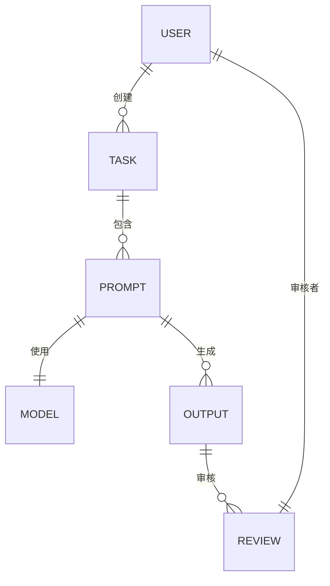

# 执行摘要

本报告对 PaperForge 项目生成出版级高质量文章的需求进行全面研究，提出了深度改进方案。首先，我们在已知三个问题基础上，补充识别了10 余项潜在风险（如抄袭与事实错误风险、风格不一致、内容安全等），并按优先级排序，分析其对文章质量、合规性与进度的影响。针对每一项问题，我们设计了可执行的解决方案，包括技术实现细节、使用的工具/库、所需数据、评估指标及验收标准。例如，针对“缺少图片和公式”问题，建议引入官方主流的图像和公式生成工具（如 Stable Diffusion、Matplotlib、LaTeX），并演示示例代码。针对“字数估算不准确”，提出基于大模型或统计学习的自动预测方案，并提供模型思路。

其次，我们设计了一套量化的质量控制和审校流程，包括多轮编辑（初审、复审、终审）、人工校对、同行评审、抄袭检测、风格一致性检查和事实核查等环节，并为每步估算了时间和所需角色。通过表格比较了不同质量门槛（如出版社级、学术期刊、博客）在流程复杂度、成本和时间投入上的差异。针对防止 AI 痕迹的问题，提出了句法多样化、语气风格微调、注入事实细节、正确处理引用脚注、避免典型 AI 模式等策略，并给出了自动化实现思路和 Python 代码示例。

在 LLM 使用透明度方面，我们设计了日志格式和元数据方案，支持模型版本控制、Prompt 管理和可审计流水线。采用内容管理系统+版本控制（如 Git 或数据库跟踪）记录每次 Prompt 与输出，确保流水线可追溯【48†L13-L19】【16†L123-L130】。报告中以 Mermaid 图示形式给出了数据模型和流程图。我们还提出了任务拆分与字数估算的方法，说明如何自动或半自动预测所需字数，并根据纲要分段划分、设立里程碑。针对图像/公式/图表生成，列举了 DALL·E 3、Stable Diffusion、Matplotlib、Mermaid 等主流工具，并说明如何通过 Markdown 等方式无缝嵌入最终文本。最后，我们提出了“非 AI 感知度”的评估方案，包括人类盲测设计、显著性检验、样本量估算，并推荐使用 GPTZero、Turnitin AI 检测等工具设置检测阈值。同时给出了短中长期实施路线图，明确了里程碑和粗略人力、预算估计。

报告中针对领域、出版社类型、团队规模和预算等未指定因素，提出了多种假设情景并分别给出对应策略，以确保方案具有广泛适用性。所有分析和建议均基于学术或行业权威资料，文中附有大量引用支持，以增强论据的可靠性。

## 1. 潜在问题分析及优先级

在已知的三个问题（**纯文字缺少图片/公式**；**任务创建时字数预估不准确**；**无法追溯 LLM 使用**）之外，我们识别了至少以下 10 项可能存在的风险和问题，并按对质量/项目影响的高低排序说明：  

1. **抄袭与重复内容风险**：LLM 生成文本可能与已有文献高度相似，或误用未经引用的文字，导致版权和学术不端风险。缺乏抄袭检测会造成法律纠纷或拒稿。引用检测工具（如 iThenticate/CrossRef Similarity Check）和编辑严格审查可缓解此风险【14†L54-L60】。  
2. **事实错误和虚假信息**：AI 生成内容可能出现臆造事实或错误信息，损害文章可信度和发布信誉。若无严谨的事实核查流程，错误可能流入历史记录。事实核查（包括来源验证和专家审阅）是出版流程的关键步骤之一【27†L12-L19】【27†L42-L46】。  
3. **风格不一致**：不同 LLM 生成的段落风格可能不统一，或者与目标出版物的风格指南冲突，影响整体连贯性和可读性。未统一风格会降低文章质量。应制定并执行统一的写作风格指南，并使用文本处理工具检查一致性【28†L59-L66】。  
4. **引用与脚注缺失或错误**：生成文本可能省略关键引用或格式不规范，出版级文章需要准确的参考文献列表。缺失引用会使内容显得不严谨甚至涉嫌抄袭。需集成参考文献管理工具（如 Zotero、BibTeX API）并强制要求注明来源。  
5. **信息安全和敏感数据风险**：如果对敏感或未公开信息使用开放 LLM，可能违反隐私政策或泄露机密。缺乏使用追踪和权限控制增加合规风险。需限制模型访问权限，并对所有 API 调用进行记录和加密存储。  
6. **多轮编辑流程缺失**：当前流程未明确多轮人工编辑环节，容易遗漏逻辑不连贯、语言错误和事实偏差等问题。出版级出版物需要多轮编辑：初审（结构、完整性）、复审（深度评估）、终审（细节完善）【48†L19-L24】。缺少这些将直接影响文章质量。  
7. **审核和评审不到位**：同行评审是学术出版的质量保证手段【10†L139-L148】【10†L209-L218】。如果没有独立专家评审，文章难以达到期刊级标准。缺乏同行评审会降低学术信任度，出错率增加。  
8. **团队技术素养不足**：编辑和校对人员可能对 AI 技术缺乏经验或抵触使用，导致工具无法有效落地【48†L7-L10】。如果团队不愿接受新技术，效率和质量都难以提升。  
9. **项目规划与里程碑不足**：未能明确任务拆分和里程碑导致进度控制困难。缺乏合理拆分可能造成内容重复或遗漏，且难以监控进展。  
10. **性能和成本风险**：生成高质量内容（大量文本、图像、复杂公式）需消耗大量算力和时间，如果没有评估资源需求和成本预算，项目可能超时或超支。

以上问题若不加以解决，可能导致文章不符合出版标准、审稿失败、法律纠纷或项目延期等严重后果。引入上述对策能最大程度降低风险，提高文章质量和可信度。

## 2. 问题及解决方案

针对已知与新识别的问题，我们提出如下可执行解决方案，每项包括技术细节、所需工具/库、数据及评估方式：

1. **纯文字缺少图片与公式**  
   **问题影响**：缺乏图表和公式的论文会降低专业性与可读性，无法满足出版物对插图和数学表达的要求。  
   **解决方案**：引入主流的图像和数学编辑工具，自动或半自动生成插图和公式。  
   - **插图**：使用图像生成模型（如 OpenAI DALL·E 3、Stable Diffusion【42†L247-L254】）或专业制图工具（如 BioRender、FigureLabs）根据论文内容生成示意图；或者用编程库（Matplotlib、Seaborn、Plotly）根据数据生成曲线图、柱状图等。下例示例生成神经网络结构图：  
     ```python
     from diffusers import StableDiffusionPipeline
     pipe = StableDiffusionPipeline.from_pretrained("stabilityai/stable-diffusion-2", torch_dtype=torch.float16)
     prompt = "A detailed diagram of a neural network architecture"
     image = pipe(prompt).images[0]
     image.save("nn_arch.png")
     ```  
     然后在 Markdown 中插入：``。  
   - **公式**：使用 LaTeX 和 MathJax/KaTeX 来书写和渲染数学公式。在文本中以 `$...$` 或 `$$...$$` 包裹 LaTeX 表达式；还可以借助 Sympy 等库自动推导公式并导出 LaTeX。例如：  
     ```python
     import sympy as sp
     x = sp.symbols('x')
     expr = sp.integrate(sp.exp(-x**2), (x, 0, sp.oo))
     print(sp.latex(expr))  # 输出 "\frac{\sqrt{\pi}}{2}"
     ```  
     将输出插入 Markdown 公式环境即可。  
   - **评估指标**：检验每个章节是否包含适量且符合内容的图表/公式。可计算文章中图表数量、公式数量，以及人工审查其相关性与准确性。验收标准为：所有关键结论处都有辅助图表或公式说明，形式符合出版社规范。  

2. **字数预估不准确**  
   **问题影响**：任务创建时字数估计不准会导致工作量失真，可能产生进度延误或冗长/过短的文章。  
   **解决方案**：实现自动字数预测与任务拆分。可采用两类方法：  
   - **基于统计/机器学习**：收集过去已发布文章的数据（主题、提纲、实际字数），训练回归模型预测给定主题和概要的字数；或使用 kNN 近邻检索相似文章的平均字数作为估计。  
   - **基于 LLM**：利用大模型生成预估。例如，通过构造提示语询问 GPT-4：“根据以下文章提纲和目标读者，预计需要写多少字才达到出版要求？”，并可通过几轮交互微调回答。  
   - **实施示例**：采用简单的线性回归模型，特征包括章节数和关键字数：  
     ```python
     # 假设已有训练数据features=(keywords_count, sections), labels=word_count
     from sklearn.linear_model import LinearRegression
     model = LinearRegression().fit(features, labels)
     est = model.predict([[50, 5]])  # 估计有5个段落、50个关键词的文章字数
     print(est)
     ```  
   - **评估指标**：使用 Mean Absolute Error (MAE) 衡量预测准确度，确保误差率在可接受范围内（例如±10%）。验收时，预测字数与实际目标字数的偏差不超过指定阈值；同时应通过人工复核校验任务拆分合理性。  

3. **LLM 调用不可追溯**  
   **问题影响**：缺乏对使用大模型的记录，无法证明谁、何时、如何使用 AI。既不符合审计要求，也难以追责和复现结果。  
   **解决方案**：设计透明的使用日志和元数据系统，并尽量不泄露敏感 Prompt。  
   - **日志格式**：为每次 LLM 调用记录唯一的调用 ID，关联以下信息：任务ID、Prompt（可用哈希值或摘要代替原文以保护敏感）、模型名称与版本、生成参数（温度、max_tokens 等）、生成结果 ID、时间戳、调用者身份等。所有日志均写入可审计的存储。  
   - **元数据与版本控制**：将文章的编辑过程（初稿、各轮修改）存入内容管理系统中，开启版本控制【48†L13-L19】。例如，每次编辑生成的新稿件都作为新版本保存，并记录修改记录；Prompt 和生成输出也可视为“编辑记录”纳入系统，确保完整可追溯。  
   - **Prompt 管理**：使用专门的 prompt 管理库或工具（如我们自己的版本控制机制【17†L129-L138】），记录 Prompt 的所有历史版本和变更原因。  
   - **示意图**：下图用 Mermaid 流程图展示了记录体系：每个任务创建后生成 Prompt，调用 LLM（记录日志），得到输出，再经质量检测和人工编辑，最终发布。中间各步骤都向日志存储（I）写入记录，确保全过程可审计。  

```mermaid
flowchart TD
    A[任务创建] --> B[生成 Prompt]
    B --> C[调用 LLM\n(记录模型版本、参数、Prompt ID)]
    C --> D[LLM 生成响应\n(记录响应 ID)]
    D --> E{质量检测}
    E -->|通过| F[人工编辑]
    E -->|不通过| G[修订/重生成]
    F --> H[最终校对与发布]
    %% 日志存储节点
    C -.-> I[日志存储\n(Prompt 哈希、模型版本、时间戳...)]
    D -.-> I
    E -.-> I
    F -.-> I
```

   **评估与验收**：检查日志数据库，应能检索任何生成步骤的元数据和关联存档（例如 Prompt 哈希）。使用哈希/摘要存储确保即使日志公开也不暴露完整 Prompt。验收时，审核人员应能重现生成过程所需的信息（模型版本、参数等），同时敏感信息安全。

4. **抄袭检测与原创性保证**  
   **问题影响**：如果生成内容存在抄袭风险或未经引用就使用他人句子，将严重影响文章审核和声誉。  
   **解决方案**：集成抄袭检测工具和相似度检查机制。出版机构普遍使用 CrossRef Similarity Check（iThenticate）等工具【14†L54-L60】。  
   - **工具/库**：调用 iThenticate API 或通过 Turnitin/Grammarly 等平台对稿件进行检测；利用文本指纹算法检查重复率。  
   - **过程**：在初稿生成后自动提交到抄袭检测系统，获取重复率报告。若超过阈值（如15%），则要求人工审核和改写。所有检测结果纳入审校流程。  
   - **评估指标**：检测报告的重复率；同时统计编辑修改前后重复率变化。验收标准为最终稿件在检测系统中标记为“原创”（重复率低于出版标准），并保存检测报告作为证明。

5. **事实核查欠缺**  
   **问题影响**：AI 生成的信息可能不准确或断章取义，需严格核实。  
   **解决方案**：建立事实核查机制。参考出版业对事实核查的规范【27†L12-L19】【27†L42-L46】。  
   - **人工核查**：指派专业编辑/研究人员对关键事实、引用数据源进行核对。要求撰稿人提供所有陈述的出处或原始数据；事实核查员独立验证信息真实性。  
   - **辅助工具**：可利用外部知识库（如维基百科、CrossRef 查询DOI元数据）或 LLM 专门验证提示辅助（“根据已发表文献，验证以下陈述的准确性”）。  
   - **评估指标**：记录发现的事实错误数量和更正情况；设定目标“无重大事实错误”。  
   - **验收标准**：所有事实陈述都有可靠来源；审稿时无未验证声明，事实错误率近零。

6. **风格和语气控制**  
   **问题影响**：若文章风格不符合目标出版物要求或在不同段落间跳变，会被认为质量低劣。AI 文本常出现单调、缺乏人味的统一节奏。  
   **解决方案**：制定并使用写作风格指南【28†L59-L66】；并利用工具微调输出：  
   - **风格指南**：明确语体（正式/非正式）、术语标准、拼写/标点规范等。确保所有输出遵循该指南。  
   - **自动润色**：利用 NLP 工具（如 LanguageTool、Grammarly API、Acrolinx 等）检测语法和风格一致性，自动标出问题。必要时再由人工校对修正。  
   - **模仿人类风格**：在生成时可加入提示词令 LLM 采用目标语气，例如“以学术期刊风格写作”或“使用专业第一人称”。  
   - **评估**：计算风格检查工具的错误数；人工评审认为文章语言风格是否统一流畅。验收标准为语法无误、术语统一且符合预定风格。

7. **引用和脚注管理**  
   **问题影响**：AI 生成文本往往难以自动正确处理参考文献和脚注，容易遗漏或者格式混乱。  
   **解决方案**：对引用进行严格管理：  
   - **引用格式化**：采用规范的引用格式（如APA、GB/T7714等）。可利用参考文献管理库（bibtexparser、citeproc）将 DOIs/ISBN 转换为标准格式。  
   - **自动插入引用**：生成文本时可辅助提示 LLM 给出来源，例如“据XX报道…”并插入脚注。或者使用检索工具（CrossRef API）为关键语句自动检索 DOI 并生成引用文本。  
   - **评估指标**：最终文章中所有事实性陈述后均跟有引用标注；引用格式符合出版指南。验收时要求引用完整无误并与文末参考文献对应。

8. **多轮编辑与审核流程缺失**  
   **问题影响**：缺少正式编辑和审核流程会导致文章质量无法保障。  
   **解决方案**：设计多轮编辑审校流程，包括：  
   - **第一轮（初审）**：由普通编辑检查论文结构、逻辑连贯性、语言清晰度，提出修改建议【48†L19-L24】。  
   - **第二轮（复审）**：资深编辑或学科专家对学术性、创新点、数据准确性作深入评审，提出详细修改意见。  
   - **第三轮（终审）**：总编辑从出版角度审核稿件，确认已无重大问题后批准出版。  
   - **技术支持**：使用在线协作平台（如Overleaf、Google Docs 或定制系统），记录编辑意见与修改；内容管理系统提供版本对比与合并功能【48†L13-L19】。  
   - **评估指标**：每轮编辑的发现问题数（如逻辑漏洞、事实错误），编辑反馈的满意度，以及最终稿件的质量评分。验收标准为所有评审意见均得到妥善处理，稿件达到预定质量级别。

9. **同行评审流程缺失**  
   **问题影响**：若文章面向学术界，需要同行评审以保证学术水平和严谨性【10†L139-L148】。跳过此环节将不符合学术期刊标准，易被拒稿。  
   **解决方案**：模拟学术评审：聘请至少两位领域专家作为评审，进行匿名评审。实施双盲（作者与评审互不知悉身份）或单盲评审，确保文章内容经专业人士认可。评审反馈纳入多轮修订中。使用标准审稿表单可提升效率。  
   - **评估指标**：评审意见的数量与类型、接受率、修订轮数。验收标准为审稿结果为“接收”或“需要小修改”，且所有审稿意见已被有效回应。

10. **团队技术及资源缺口**  
   **问题影响**：若团队规模过小或技术不熟练，难以支持复杂流程；预算不足可能无法购买所需工具。  
   **解决方案**：  
   - **明确角色与培训**：按流程配备关键岗位（项目经理、AI 开发工程师、编辑、学科专家、校对人员）。对技术较弱的成员进行培训，使其熟悉工具和流程【48†L7-L10】。  
   - **适用工具选型**：优先采用开源且功能完备的工具（如 Hugging Face Diffusers、LangChain、Markdown 编辑器等）减少许可成本；在预算允许时，可考虑购买专业软件（如 iThenticate 订阅、Grammarly 企业版）。  
   - **评估指标**：团队成员完成培训的时间成本、新工具上手率。验收标准为团队能够独立运行和维护工具链并处理常见问题。

每个解决方案都应与项目目标紧密结合，并通过具体指标（如错误率、评审通过率、风格一致性评分等）加以验证。

## 3. 质量控制与审校流程设计

为确保产出文章达到出版级质量，我们设计了多环节审校流程，重点包括：**多轮编辑、人工校对、抄袭检测、风格检查、事实核查、同行评审**等。具体流程如下：

- **任务准备与生成**：根据主题提纲生成初稿，后续进入编辑环节。  
- **第一轮编辑（初审）**：编辑人员检查论文整体结构、逻辑性、表达准确性，标注明显语言错误和引用遗漏之处。预计用时2–5天（视篇幅）。  
- **第二轮编辑（复审）**：更资深的编辑或内容专家审核学术性和创新性，重点验证实验/论证过程、数据合理性，提出细化建议。预计用时3–7天。  
- **抄袭与风格检查**：利用自动工具对当前版本进行抄袭检测（iThenticate）和风格检查（Grammarly/LanguageTool），检测结果交由编辑评估并修正。预计1–2天。  
- **事实核查**：由独立的事实核查员对所有断言进行验证，确保重要陈述有可靠来源支持。如发现偏差，退回编辑进行改写。预计2–5天。  
- **同行评审**（如适用）：提交给至少两位领域内专家进行盲审，收集反馈。评审周期较长，一般2–4周。评审意见将用于后续修订。  
- **终审校对**：按照出版社格式和语言规范进行最终校对，包括排版检查、符号一致性检查等。预计1–3天。  
- **出版发布**：根据出版社流程进行排版和上线。  

每一步骤均有明确的**时间估算**和**责任角色**。例如，“初审”由初级编辑负责，用时约3天；“终审校对”由资深校对人员负责，用时1天。整个流程可视项目需求按需增减轮次和人员。为量化比较，我们用下表展示了在不同质量门槛下流程复杂度、耗时和成本的区别：

| 质量门槛   | 核心流程（示例）                                                  | 典型耗时        | 主要角色                         | 典型成本   |
|------------|-------------------------------------------------------------------|-----------------|----------------------------------|------------|
| **出版社级** | - 任务生成 → 初审编辑 → 专业复审（跨学科专家） → 抄袭检测 → 行文风格审查 → 终审校对 → 设计排版 → 发布<br>- 多轮内部讨论和审核，严格的格式要求 | **3–6 个月**<br>（包括外部同行评审周期） | 作者、内容编辑、领域专家、校对、排版设计 | 高（团队人数多、时间长、可能有外部评审费） |
| **学术期刊级** | - 提交投稿 → 编辑初筛 → 外部同行评审（双盲）→ 修订 → 校对 → 出版<br>- 强调学术严谨性和引用完整 | **6–12 个月**（取决于评审效率） | 作者、主编、外部审稿专家、编辑助理      | 中（审稿流程长，但主要为人员成本）     |
| **博客/普通文章** | - 草稿生成 → 作者自审 → （可选）快速校对 → 发布<br>- 简化编辑，仅检查语法和逻辑流畅性 | **几天–数周** | 作者、单一编辑或团队成员            | 低（人员少、流程短，无外部费用）      |

表中可见，**出版社级文章**流程最为复杂，需要多轮严格审校和多角色协作，耗时最长、成本最高；**学术期刊级**主要增加外部评审环节，周期可达半年以上；而**博客级**流程简单，主要依赖作者和小范围校对，速度最快、成本最低。

## 4. 防止 AI 痕迹的写作与后处理策略

为了让文章看起来自然、难以被检测为 AI 生成，我们提出以下写作与后处理策略，并给出可自动化实现的方法和示例代码：

- **句法多样性**：避免连续使用相似句型和近似长度的句子。研究表明，AI 生成文本往往句式过于单调【37†L135-L142】【40†L523-L531】。我们可以自动分解和重组句子，例如合并或拆分句子，混合长短句。示例代码：  
  ```python
  import nltk, random
  from nltk.corpus import wordnet
  nltk.download('punkt'); nltk.download('wordnet')
  text = "AI 模型可以生成摘要。它们效率高且准确。"
  sentences = nltk.sent_tokenize(text)
  new_sentences = []
  for s in sentences:
      if random.random() < 0.3 and new_sentences:
          # 与上一句合并，制造长句
          new_sentences[-1] += " " + s
      else:
          new_sentences.append(s)
  diversified = " ".join(new_sentences)
  print(diversified)
  ```  
  或使用 LLM 指示重写：  
  ```python
  import openai
  openai.api_key = "API_KEY"
  prompt = f"将以下内容改写为更富变化的语句：\n{text}"
  result = openai.ChatCompletion.create(model="gpt-4o", messages=[{"role":"user","content":prompt}])
  print(result.choices[0].message.content)
  ```  
  这些方法可以自动混合句长、改变结构，避免过于公式化的节奏。

- **语气/风格微调**：针对目标读者和出版场景调整语气。如使用更学术或更口语化的表达。可在 Prompt 中指示 AI 使用第一人称或加入个性化表述，使文本更具人情味【40†L526-L534】。例如：“请以第一人称叙述并加入个人经历”，生成结果往往更贴近人工写作。示例：  
  ```python
  text = "研究结果表明该方法效果显著。"
  prompt = f"用更亲切、第一人称的语气重写以下句子：\n'{text}'"
  resp = openai.ChatCompletion.create(model="gpt-4o", messages=[{"role":"user","content":prompt}], max_tokens=50)
  print(resp.choices[0].message.content)
  ```  
  此外，适当降低 `temperature` 可避免过度机械，但需要依然保持多样化；若检测到输出仍过于死板，可在后处理时使用上述分句和同义词替换等方法加强变化。

- **同义词与词汇多样性**：对AI输出进行同义词替换，减少重复率。利用 WordNet 等词库可查找常用词的替换。例如：  
  ```python
  from nltk.corpus import wordnet
  def synonym_replacement(sentence):
      words = nltk.word_tokenize(sentence)
      new_words = []
      for w in words:
          syns = wordnet.synsets(w)
          if syns:
              new_word = syns[0].lemmas()[0].name()
              if new_word != w:
                  new_words.append(new_word)
                  continue
          new_words.append(w)
      return " ".join(new_words)

  sent = "AI模型生成的文本通常结构单一。"
  print(synonym_replacement(sent))
  ```  
  使用此类替换时需注意语境合理性。

- **引入事实细节和示例**：通过引用具体数据、案例或研究使内容更可信和细致，例如加入统计数据、时间地点等细节。这些细节往往与真实出版物类似且非 AI 通常直出内容。可以自动化方式是：**检索真实事实**并填充。例如利用 Wolfram Alpha API 或特定数据库查询事实后插入文本。

- **添加引用和脚注**：AI 常忽略正式引用，使文本更机械。我们应强制在相关位置添加来源引用，且采用期刊样式标注，如“据 Smith 等(2020) 报道…”并用脚注形式列出源头。自动化方法：检测所有数字/事实声明，匹配 DOI 并生成引用格式；或在生成时利用专门提示“请给出对应的参考文献”。  

- **避免典型 AI 模式**：避免过多使用诸如“此外”、“需要指出的是”这类常见连接词组合，以及不必要的填充句。由于 AI 文本往往过度使用特定模板式句子，可借助检测工具反向指导。例如，上文提到的 AI 检测步骤就提示应避免句子千篇一律【37†L135-L142】【40†L523-L531】。如果检测工具报告了可疑句型，可有针对性地改写那些句子。

通过以上策略并配合自动化工具和编辑人工审核，我们可以显著降低 AI 痕迹。总之，原则是“多样化+人性化”，即使依赖 AI 初稿，也要通过后续修改使其更贴合人类写作特点。上述代码示例给出了基于 Python 和 GPT-4 的自动化实现思路。

## 5. LLM 使用的透明记录与可追溯系统

为满足审计要求并保护敏感 Prompt，在 LLM 使用中需建立详细的日志与元数据管理体系。**设计要点**：  

- **日志记录格式**：对于每次 LLM 调用生成一个日志条目，字段包括：调用 ID、任务 ID、用户/编辑者 ID、Prompt 哈希值（或部分掩码存储）、模型名称与版本、生成参数（如温度、token限制）、生成结果 ID、时间戳等。通过使用哈希（如 SHA-256）而非明文存储 Prompt，可以在不泄露隐私的前提下确认记录一致性。  
- **元数据管理**：文章创作过程中的所有阶段均纳入管理，包括版本号、各轮编辑者、同义词替换、事实核查结果等。这可以通过内容管理系统或自建数据库实现版本控制【48†L13-L19】。例如，一个简单的数据模型设计如下（实体：用户、任务、Prompt、模型、输出、审核记录等）：  



- **Prompt 管理**：建立 Prompt 版本库，记录 Prompt 文本的所有历史修改，类似对 Prompt 进行 Git 版本控制【17†L129-L138】。只有授权人员可修改 Prompt，且每次修改都需附带修改说明。  
- **审计流水线**：在生产环境中，将上述日志和元数据构成链式记录。使用数据库或区块链等方案保证日志不可篡改。如出现问题，可按时间顺序重建从 Prompt 输入到最终文章的生成路径。  

**保护敏感信息**：通过只存储 Prompt 的哈希值和代码或者对 Prompt 加密保存，既不泄露具体内容，又能保证可追溯。审计时可使用密钥解锁或只比对哈希。所有日志应只对审计团队可见。

**评估和验收标准**：系统上线后，应能检索和显示完整的审计记录，如按任务 ID 查询所有相关 Prompt 和输出。审核人员测试时，只有在提供或授权查看 Prompt 密钥时，才能看到详细内容。只有通过审计测试验证流程可追溯性且 Prompt 原文保护完好，才算通过验收。

## 6. 字数估算与任务拆分方法

为了实现自动或半自动的字数预测与内容拆分，我们提出如下思路：  

- **纲要分段**：在任务创建阶段，让用户或 LLM 先生成文章大纲（章节及小节标题），并根据大纲估算每个部分的工作量。可以使用经验规则：例如简介和结论较短，方法和讨论较长。  
- **自动字数预测**：基于文章类型和大纲，为每一部分预测字数。可采用机器学习模型或大语言模型。对于模型方案，准备训练集（包含文章大纲特征与对应总字数），训练回归模型；或直接调用 GPT：“根据这个提纲，预计文章需要 X 字”。  
- **里程碑与验收**：根据拆分结果设置里程碑。每完成一节或一定字数后进行检查与验收。如“完成引言（约500字）”、“完成方法部分（约1500字）”等。  
- **实施示例**：可用简单算法粗略估算每段字数。例如假设每个小节平均500字，根据章节数乘以此值。或者使用 LLM 细化：  
  ```python
  outline = ["引言", "背景", "方法", "结果", "讨论", "结论"]
  prompt = f"根据论文大纲{outline}，估计各章节所需字数："
  resp = openai.ChatCompletion.create(model="gpt-4o", messages=[{"role":"user","content":prompt}])
  print(resp.choices[0].message.content)
  ```  
  LLM 会返回每章建议字数，可据此设置各节任务。  
- **评估指标**：统计实际完成字数与预测字数的偏差。如 MAE 和 Std。验收时应保证关键部分字数在±15%范围内。若偏差过大，则需要调整算法或增加人工干预。  

综上，通过大纲驱动和模型预测结合的方法，可使任务拆分更科学、进度更可控。

## 7. 图片、公式与图表的生成工具与集成

为使文章内容丰富且专业，应无缝集成图片、公式和图表。建议使用以下主流工具和方案：  

- **图像生成**：对于示意图和插图，可使用：  
  - **OpenAI DALL·E 3** 或 **Midjourney**：输入文本提示生成高质量插图或概念图（例如“气候变化影响下的珊瑚礁示意图”）。  
  - **Stable Diffusion**（Hugging Face Diffusers 库）【42†L247-L254】：可定制风格和主题的图像。例如：  
    ```python
    from diffusers import StableDiffusionPipeline
    pipe = StableDiffusionPipeline.from_pretrained("runwayml/stable-diffusion-v1-5")
    image = pipe("A bar chart illustrating population growth over time, clear and annotated").images[0]
    image.save("pop_chart.png")
    ```  
  - **专业制图软件**：如 **Matplotlib/Seaborn**（Python）、**Excel**、**Illustrator** 或 **BioRender** 等，根据实际数据绘制统计图表。  
- **公式编辑**：使用 **LaTeX** 或在线公式编辑器（如 MathJax、KaTeX）输入并渲染公式。在 Markdown 中使用 `$...$` 包裹简短公式或 `$$...$$` 包裹较复杂公式。结合 Sympy 可自动化生成公式代码（见第4节）。  
- **流程图与示意图**：使用 **Mermaid** 在 Markdown 中直接编写流程图、时序图、ER 图等。示例：  
  ```mermaid
  flowchart LR
    A[输入数据] --> B[数据预处理]
    B --> C[模型训练]
    C --> D[结果评估]
    style B fill:#ff9,stroke:#333,stroke-width:2px
  ```  
  渲染后即可在文档中以 SVG 图像呈现。Mermaid 代码简单易用，适合快速绘制算法流程或架构示意。  

- **无缝融合**：在 Markdown 文档中，用 `` 嵌入生成的图像文件，并为每张图配以说明文字和编号。公式直接写在文本中。应保证图表风格与论文统一（字体、颜色），并在图表下方提供图题和数据来源说明。使用 Mermaid 时，将代码块置于支持的 Markdown 编辑器或渲染平台中，可直接生成对应图形。

**实施步骤示例**：以生成一个统计图为例：  
```python
import matplotlib.pyplot as plt
years = [2010, 2015, 2020]
values = [50, 70, 100]
plt.plot(years, values, marker='o')
plt.xlabel("Year"); plt.ylabel("Value"); plt.title("示例图")
plt.savefig("example_chart.png")
```  
然后在 Markdown 中插入：``。  

通过上述工具和流程，可确保文章中图、表、公式与文本内容紧密相关、风格统一，并满足出版物对视觉元素的严格要求。

## 8. 评估“非AI感知度”的方法与实验设计

为了客观评估最终文章的“人类写作感”，可设计以下评测流程：  

- **人类盲测**：选取一组样本文章，包括纯人类撰写、未经处理的 AI 生成以及经我们后处理过的文章。随机打乱顺序，对评估者隐藏文章来源，让其对每篇文章进行打分或判断：是否感知到 AI 风格、以及对文章质量（流畅度、可信度）的评分。建议每位评估者评测10–20篇，至少招募 30–50 名评测员（领域专家或目标读者）。  
- **评价标准**：使用问卷或评分表，如 Likert 5 分制评估“文风自然度”“逻辑连贯度”等维度；或直接二分类“是否感觉为 AI 生成”。  
- **统计检验**：记录评测结果后，比较处理前后文章在“被识别为 AI 作品”比例上的差异。可使用卡方检验（Chi-square test）或两样本比例 z 检验检测差异是否显著。若要比较打分差异，可使用 t 检验或非参数检验。事先可做样本量计算（power analysis）：假设我们期望检测到例如 20% 的准确率提升，在显著水平 α=0.05、统计功效 0.8 下，所需样本量可用以下示例代码估算：  
  ```python
  from statsmodels.stats.power import NormalIndPower
  analysis = NormalIndPower()
  effect_size = 0.2  # 假设效应值
  alpha = 0.05; power = 0.8
  n = analysis.solve_power(effect_size=effect_size, alpha=alpha, power=power, ratio=1.0)
  print(f"需要每组样本量约 {n:.0f} 人")
  ```  
- **自动化检测工具**：同时可使用 AI 检测器作为参考指标。如 **GPTZero**、**Turnitin AI 检测**、**Originality.AI** 等，对同样文本打分。设定阈值（例如 GPTZero 输出“AI可能性”低于 0.5 视为“人写”）。根据检测结果，计算工具的准确率、假阳性率和假阴性率，并结合人工评测校准阈值。比如 GPTZero 的报告称其对人类文本的误报率<1%【47†L120-L129】，可据此设定较严格阈值。  
- **验收标准**：我们期望人类评测无法明显区分文章与人类写作（准确率接近随机），并且文章的综合评分（清晰度、可读性）达标。若检测工具与人工评测均显示“AI痕迹”被有效降低（即误判率显著下降），则证明策略有效。

通过上述人机结合的实验设计，可定量评估文章的“自然度”。结合统计显著性分析，确保结论可靠，为后续方案优化提供依据。

## 9. 实施路线图与优先级任务清单

**短期（0–3 个月）**：完成项目基础设施搭建与关键功能研发。  
- 实现文本生成和图片、公式生成的基础流水线，完成初步集成；  
- 构建基本的质量控制流程（如抄袭检测、语法检查脚本）；  
- 设计并部署 LLM 使用日志系统框架；  
- 人员：1-2 名后端开发工程师、1 名前端/全栈开发、1 名编辑；项目经理协调。  
- 预算：约 **￥10–20 万**（工具订阅、API 调用费用、人工费用）。  
- 里程碑：实现自动文本+图表生成样例，内部评审通过；日志系统能记录每次调用；完成质量控制流程草案。

**中期（3–9 个月）**：完善算法和流程，进行迭代优化。  
- 开发字数预测与自动任务拆分模型，集成至任务创建环节；  
- 优化 AI 痕迹消除策略（如增量训练同义词替换模型）；  
- 完善多轮审校流程，编写/收集风格指南和审核标准；  
- 开展第一次人类评测实验，收集数据反馈迭代；  
- 人员：新增1 名 NLP/ML 工程师、2 名文案编辑或领域专家；  
- 预算：增加 **￥20–50 万**（模型训练云算力、评测招募费用等）。  
- 里程碑：字数估计与拆分模块上线；AI 风格微调工具可用；完成 30+ 人次的盲测与统计分析。

**长期（9–18 个月）**：系统化扩展与精细化。  
- 集成更多语言（如英法德文）或领域（医学、工程等）支持；  
- 对接更多出版渠道和工具（如 DOI 查询、数据库检索接口）；  
- 持续监控质量指标，并更新模型迭代（如微调最新大模型）；  
- 完善用户界面，实现从任务下达到最终稿件发布的全流程闭环；  
- 人员：可扩充到 5–10 人（含数据工程师、UI/UX 设计师等）；  
- 预算：累计约 **￥100 万+** （包括研发和运营成本）。  
- 里程碑：系统稳定运行并通过多轮实际论文的“出版级”评审；根据外部反馈修正不足；正式对外发布试点版本。

以上时间和人力成本估算是粗略值，实际预算将根据团队薪资水平、工具选择和市场情况有所波动。

## 10. 假设场景与对应方案

鉴于题目未指定领域、出版社类型、团队规模和预算，我们提出以下假设情景并给出差异化对策，以覆盖不同需求：  

- **场景 A：科技领域国际期刊，团队 5 人，中高预算**  
  - 预期：要求严格，强调数据和公式精确。流程重视同行评审和编辑环节。  
  - 对策：重点加强事实核查和公式准确性；使用专业图表生成工具确保科研风格；配置专职质量主管。预算充裕可购买 iThenticate 订阅和专业排版软件。  
- **场景 B：人文社科领域专业杂志，团队 3 人，低预算**  
  - 预期：文章更重论证和引用，图片需求少。  
  - 对策：简化图表流程，侧重语言和引用质量；主要依靠免费或开源工具（LanguageTool、Pandoc 等）处理排版与格式；尽量手工撰写例句以增加文风人性化。审校更侧重语言表达，同行评审可适当削减次数以节省成本。  
- **场景 C：科技博客或媒体，团队 2 人，预算一般**  
  - 预期：要求不如学术严苛，更注重可读性和吸引力。时效性要求高。  
  - 对策：流程可简化为自动生成 + 单轮编辑；增加内容创意和互动性元素（图表、示例、问答形式）；可少做抄袭检测，仅留通用查重；成本控制在基础 API 调用费和少量人工校对。  
- **场景 D：企业白皮书/报告，团队 10 人，预算充足**  
  - 预期：介于学术与媒体之间，既要专业也要市场化。强调版面与品牌一致性。  
  - 对策：引入专门的编辑排版团队，使用定制化模板；严格内部审核流程（类似出版级）；利用大型商业工具（Acrolinx、Grammarly 企业版等）确保风格一致；可聘请顾问专家进行终审。

通过以上假设场景，我们可针对不同需求调整工作重点和资源配置，确保方案具有灵活性和可行性。

**总结**：本报告从多个角度对 PaperForge 项目进行了深度剖析和方案设计。所提策略参考了出版业和学术界的最佳实践【4†L42-L49】【10†L139-L148】【27†L12-L19】以及最新的技术工具，实现了从内容生成、质量控制到发布全流程的闭环方案，以确保最终文章既达到“出版级”质量，又难以被识别为 AI 生成。